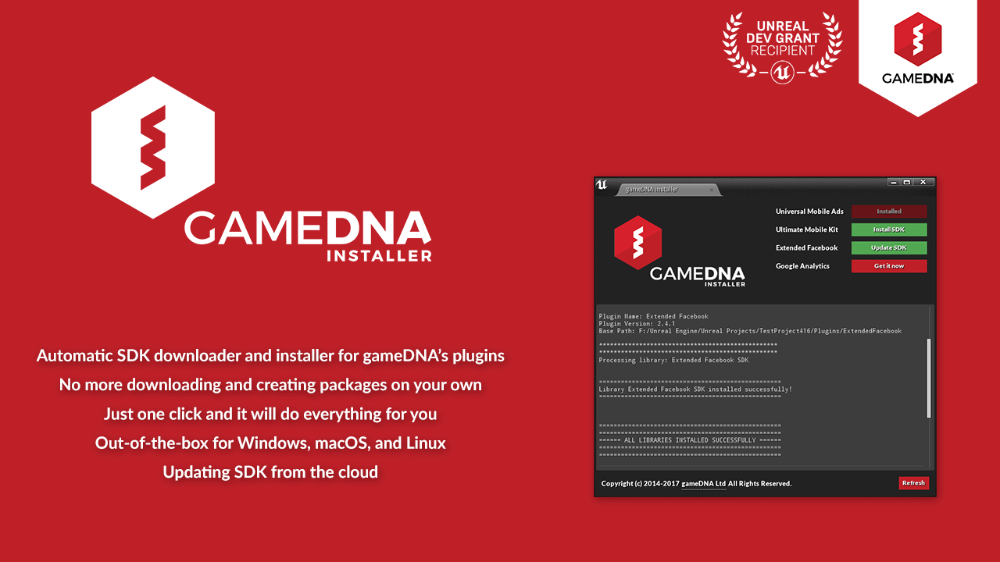
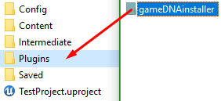
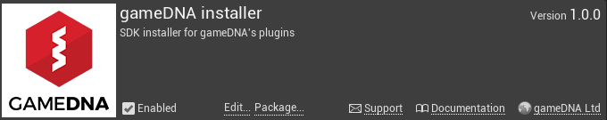
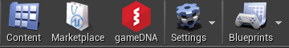
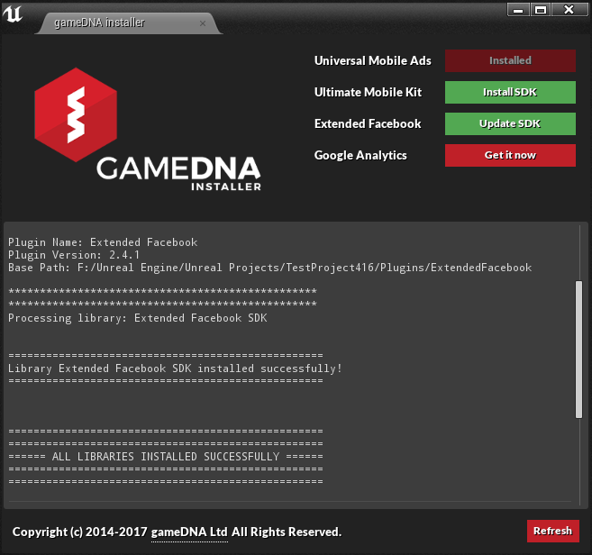

# gameDNA installer

**gameDNA installer** is an automatic SDK downloader and installer for gameDNA's plugins. No more downloading SDKs and creating packages on your own! Just one click and it will do everything for you!

* **Current version:** 1.7.0
* **Binaries compiled for:** Unreal Engine 4.23
* **Required Unreal Engine 4.23 or above.**

## Features
* Automatic SDK downloader and installer.
* Updating SDK from the cloud.
* No more downloading and creating packages on your own.
* Just one click and it will do everything for you.
* Out-of-the-box for Windows, macOS, and Linux.

## User Guide
More info about plugin and installation instructions you can find in [User Guide](Documentation/gameDNAinstaller_UserGuide.pdf).

## Getting Started:

1. Unpack the plugin archive to the _Plugins_ folder in your UE4 project folder (for project plugins) or _Engine/Plugins/Marketplace_ (for engine plugins) and start the editor.

    

2. Enable _gameDNA installer_ in _Edit -> Plugins -> Misc -> gameDNA installer_.

    

3. Go to _Edit -> gameDNA_ or click on the _gameDNA_ icon on the toolbar in the _Level Editor_.

    

4. Android configuration:

    a) Go to _Project Settings -> Platforms -> Android_ and change _Minimum SDK Version_ to 16 and _Target SDK Version_ to 27.
    
    b) Go to _Project Settings -> Platforms -> Android SDK_ and change _SDK API Level_ to _latest_ and _NDK API_ Level to _android-19_.
    
    c) Go to the _NVIDIA CodeWorks_ installation path and run _Android SDK Manager_.

    You can find it typically in:

    * Windows: _C:/NVPACK/android-sdk-windows/tools/android.bat_
    * macOS: _/Users/[username]/NVPACK/android-sdk-macosx/tools/android_

    Install or update the following libraries:

    * Android 8.1.0 (API 27) SDK Platform
    * Android Support Repository
    * Android Support Library
    * Google Play Services
    * Google Repository

5. Now, the _gameDNA installer_ main window is visible and you can install or update SDKs for installed plugins in the engine and/or a project. Relax and enjoy. That's all!

    
    
6. If you experience TLS certificate error on macOS, please update mono to the newest version: [https://www.mono-project.com/docs/getting-started/install/mac/](https://www.mono-project.com/docs/getting-started/install/mac/)

7. If you experience the infamous _64k methods_ error, you should download and install the free *MultiDex* plugin: 
    * GitHub: [https://github.com/gameDNAstudio/MultiDex](https://github.com/gameDNAstudio/MultiDex)
    * Marketplace: [https://www.unrealengine.com/marketplace/multidex](https://www.unrealengine.com/marketplace/multidex)

8. If you have any antivirus software installed on your computer, please add the following file to the whitelist: _[PLUGIN_FOLDER]/Extras/Core/gameDNAinstaller.exe_. The file is 100% safe but is not present in antivirus databases so it can be reported as a Trojan by some programs.
